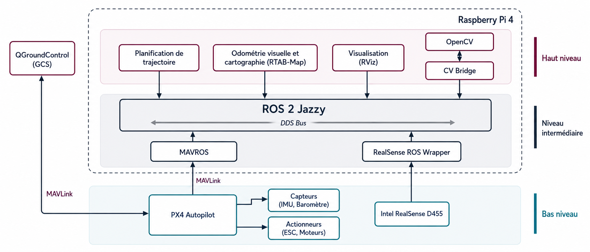

# Système embarqué pour drone autonome sans GPS (PX4 + ROS 2 + VIO/SLAM)

<video src="imgs/Screencast%20from%202026-05-10%2016-16-38.mp4" controls width="100%"></video>

[Si la vidéo ne s'affiche pas, cliquer ici](imgs/Screencast%20from%202026-05-10%2016-16-38.mp4)

Ce dépôt implémente une chaîne complète de contrôle autonome d’un drone en environnement **GPS-denied** :
- contrôle de vol PX4 (SITL ou réel),
- abstraction de mission (C et Python/MAVSDK),
- intégration ROS 2 Jazzy via MAVROS,
- perception visuelle (ArUco),
- VIO/VSLAM avec RTAB-Map.

Le projet est basé sur le rapport TER (`guide/rapport_px4_vio_drone (1).pdf`) et fournit aussi un environnement **Docker AIO** reproductible.

## Architecture du système

1. **PX4 (Pixhawk / SITL)** : stabilisation et commandes bas niveau.
2. **ROS 2 Jazzy** : orchestration des nœuds de perception/navigation.
3. **MAVROS** : pont MAVLink ↔ topics/services ROS 2.
4. **VIO + RTAB-Map** : estimation de pose locale + correction de dérive (loop closure).
5. **Atterrissage de précision** : détection ArUco + asservissement vitesse + déclenchement `AUTO.LAND`.

## Matériel cible (rapport)

- Châssis : Holybro X500 V2  
- Contrôleur de vol : Pixhawk (PX4)  
- Ordinateur compagnon : Raspberry Pi 4  
- Capteur vision/profondeur : Intel RealSense D455

## Arborescence utile

```text
docker/                         # Dockerfile, compose, scripts de démarrage
guide/                          # Rapport du projet (PDF)
imgs/                           # Captures, schéma, vidéo
workspace/libs/mavlink          # Headers MAVLink pour les exemples C
workspace/src/c                 # Contrôle MAVLink direct en C
workspace/src/python            # Scripts mission Python (MAVSDK)
workspace/src/ros_src/drone_control
  ├─ drone_control/             # Nœuds ROS 2 (offboard, vision, landing)
  ├─ launch/                    # aruco_landing.launch.py
  ├─ setup.py / package.xml
```

## Démarrage rapide (recommandé) : Docker AIO

### Ubuntu 24.04 (Wayland/XWayland)

```bash
xhost +local:docker
docker compose -f docker/docker-compose.yml build
docker compose -f docker/docker-compose.yml up -d
docker compose -f docker/docker-compose.yml exec drone-dev bash
```

### WSL2 + WSLg (Windows)

```bash
docker compose -f docker/docker-compose.yml -f docker/docker-compose.wsl.yml build
docker compose -f docker/docker-compose.yml -f docker/docker-compose.wsl.yml up -d
docker compose -f docker/docker-compose.yml -f docker/docker-compose.wsl.yml exec drone-dev bash
```

### Premier lancement dans le conteneur

Le conteneur :
1. clone automatiquement `PX4-Autopilot` (par défaut `v1.16.0`) dans `workspace/PX4-Autopilot`,
2. build automatiquement le workspace ROS (`workspace/src/ros_src`) s’il n’est pas encore compilé.

### Lancer toute la stack simulation (guide §9) en une commande

Dans le conteneur :

```bash
start_aio_stack.sh
tmux attach -t drone-aio
```

Cette commande démarre :
- PX4 SITL + Gazebo (`gz_x500_depth`)
- MAVROS
- bridge `/clock`
- bridge camera RGB + camera_info + profondeur
- TF statique `base_link -> camera_link`
- RTAB-Map
- relay odométrie `/rtabmap/odom -> /mavros/odometry/out`
- un terminal `mission` prêt à exécuter vos scripts.

## Exécuter les missions

Dans le terminal `mission` (ou un shell avec ROS sourcé) :

```bash
# ROS 2 offboard
ros2 run drone_control hover
ros2 run drone_control square
ros2 run drone_control circle
ros2 run drone_control body

# Atterrissage de précision ArUco
ros2 launch drone_control aruco_landing.launch.py
```

Scripts Python MAVSDK :

```bash
cd /work/workspace/src/python
python3 takeoff.py
python3 landing.py
```

## Exécution manuelle (hors Docker, résumé du rapport)

1. Installer ROS 2 Jazzy + MAVROS + bridges + RTAB-Map + topic_tools.
2. Installer les datasets GeographicLib MAVROS.
3. Lancer PX4 SITL : `make px4_sitl gz_x500_depth`.
4. Lancer les 6 autres terminaux ROS (MAVROS, clock bridge, camera bridge, TF, RTAB-Map, relay).
5. Exécuter les missions Offboard / ArUco.

## Paramètres EKF2 recommandés (vol sans GPS)

À configurer côté PX4 (QGroundControl / shell MAVLink) selon le rapport :

```text
SYS_HAS_GPS   = 0
EKF2_EV_CTRL  = 15
EKF2_HGT_REF  = 3
EKF2_GPS_CTRL = 0
EKF2_EV_DELAY = 175
```

## Exemples C (MAVLink direct)

```bash
cd workspace/src/c
gcc -I../../libs/mavlink -o ../../bin/simple_takeoff simple_takeoff.c
gcc -I../../libs/mavlink -o ../../bin/simple_landing simple_landing.c
gcc -I../../libs/mavlink -o ../../bin/rethome rethome.c
gcc -I../../libs/mavlink -o ../../bin/waypoints waypoints.c -lm
```

## Médias du projet

### Schéma



### Captures


.png)
.png)

### Démo vidéo

[Voir la vidéo de démonstration](imgs/Screencast%20from%202026-05-10%2016-16-38.mp4)

## Réseau/ports MAVLink

- `14540/udp` : contrôle Offboard (scripts C/Python),
- `14550/udp` : télémétrie/GCS,
- `14557/udp` : flux MAVROS haut débit.

## Références

- Rapport complet : `guide/rapport_px4_vio_drone (1).pdf`
- PX4 Autopilot : https://github.com/PX4/PX4-Autopilot
- MAVROS : https://github.com/mavlink/mavros
- RTAB-Map : https://github.com/introlab/rtabmap_ros
